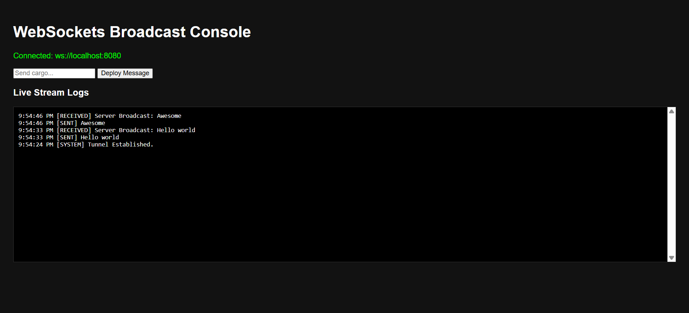

# websocket-broadcast-hub
A lightweight Node.js WebSocket server and client dashboard for real-time global message broadcasting using the ws library.

This project features a minimalist, cyber-themed dark UI console that allows multiple clients to connect, send data payloads ("cargo"), and instantly receive global server broadcasts over an established WebSocket tunnel.

## 🚀 Features

* **Real-time Global Broadcasting:** Any message sent by a single client is instantly broadcasted by the server to all currently connected clients.
* **Live Stream Logging:** A persistent frontend dashboard tracking timestamped system status, outbound messages, and inbound server payloads.
* **Robust Connection Handling:** Built-in error logging and connection tracking (capturing client IP metadata) on the server side.
* **Visual State Management:** UI changes state dynamic colors (`🟢 Connected` / `🔴 Disconnected`) based on the active handshake tunnel.

## 🛠️ Tech Stack

* **Backend:** Node.js, `ws` (WebSocket library)
* **Frontend:** HTML5, CSS3 (Dark Theme Vanilla UI), Native JavaScript WebSocket API

## 📦 Installation & Setup

Follow these steps to get your local development environment up and running.

### Prerequisites
- Node.js v24.x or higher
- npm or yarn

### Steps
1. **Clone the repository:**
   ```bash
   git clone https://github.com/Legendsusama/websocket-broadcast-hub.git
   cd websocket-broadcast-hub

2. **Install Dependencies:**
   ```bash
   npm install

3. **Start the Server (Terminal 1):**

    Launch the WebSocket backend server:
   ```bash
   npm run dev
   
4. **Connect via CLI Client (Terminal 2):**

    Open a brand-new terminal window and connect directly to your live server using wscat:
    ```bash
   wscat -c ws://localhost:8080

5. **Open the Web UI:**

    Finally, open the index.html file in your preferred web browser.


